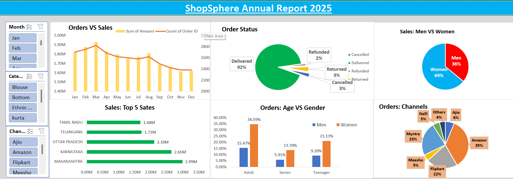

# 📊 Excel Sales Dashboard – Annual Report 2025

An interactive Excel dashboard built to analyze sales performance, customer behavior, and order insights.

---

## 📷 Dashboard Preview

---

## 🎯 Project Objective
To analyze annual sales data and extract meaningful business insights using Excel.

---

## 🛠 Tools & Skills Used
- Microsoft Excel
- Pivot Tables
- Pivot Charts
- Slicers
- Data Cleaning
- Data Analysis

---

## 📊 Key Insights
- 👩 Women contribute 64% of total sales
- 📦 92% orders successfully delivered
- 🏆 Maharashtra generated highest sales
- 🛒 Amazon is the top performing sales channel

---

## 📁 Dataset Information
- Sales Data
- Order Status
- Customer Age & Gender
- State-wise Sales
- Channel-wise Orders

---

## 🚀 How to Use
1. Download the Excel file
2. Open in Microsoft Excel
3. Use slicers to interact with dashboard

---

## 👤 Author
Nitin Kumar  
Aspiring Data Analyst | Excel | SQL | Power BI | Python
